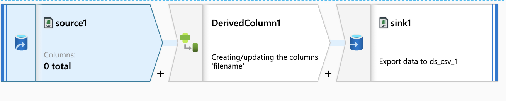
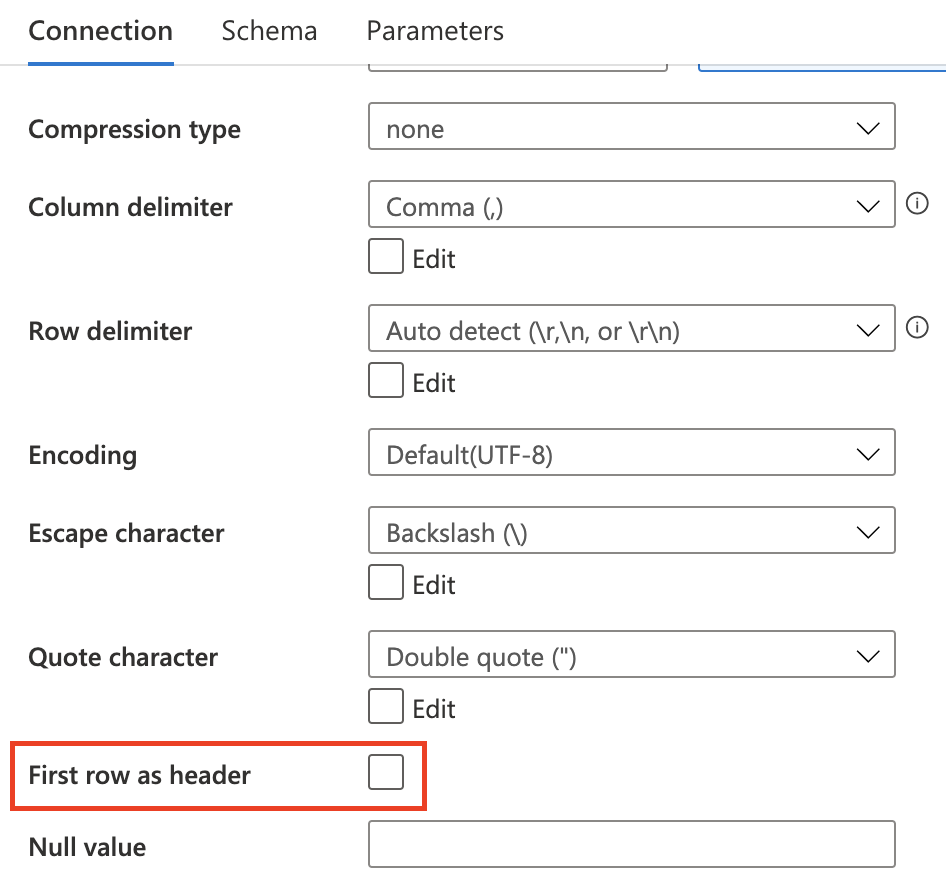

Recently I'm working in Azure to implement ETL jobs. The main tool is ADF (Azure Data Factory). This post show some solutions to resolve issue in my work.

<!-- more -->

# Task1

Process CSV files and merge different system files into one file

- Source: CSV files with filename format (*abcd_yyyymmdd_uuid.csv*), where abcd is system id.
    - a_20180101_9ca2bed1-2ed0-eaeb-8401-784f43755025.csv
    - a_20180101_cca2bed1-aed0-11eb-8401-784f73755025.csv
    - b_20190202_ece2bed1-2ed0-abeb-8401-784f43755025.csv
    - c_20180101_ada2bed1-2ed0-22eb-8401-784f43755025.csv
- Sink: yyyymmdd.csv
    - 20180101.csv
    - 20190202.csv


## ADF Pipeline


## Activities

### Get Metadata
- Input: source directory/parameters
- Output: metadata of each object

Get Metadata activity iterate source directory to obtain each object. The most important one is **Argument**


### ForEach 
- Input: output of *Get Metadata*
- Output: None

ForEach activity is used to process each object in source direcoty.

```sh
@activity('Get Metadata1').output.childItems
```


### Set Variables
It's convenient to predefine a value used in next step.


### Dataflow


The dataflow merge all files with same date, and source1 and sink are the same destination.
So, initially source1 is empty and check this options.


The only configuration in Sink is the <span style="color: rgb(0, 200,200)"> *File name option* </span>


#### Aggregation of filenames
The last problem in dataflow is how to merge files with same date in dataflow, which means we firstly find out all these files.
The solution to this problems is regex expression.


# Task2
Generally CSV file has a header and we can process it easily in ADF. However, a special case is a large CSV file has multiple different headers and we need to automatically split it into regular csv files with headers respectively.

- Sample data:
    > h1,h1_col1,h1_col2,h1_col3
    > h2,h2_col1,h2_col2,h2_col3,h2_col4,h2_col5
    > h3,h3_col1,h3_col2
    > h1,h1_row1_1,h1_row1_2,h1_row1_3
    > h1,h1_row2_1,h1_row2_2,h1_row2_3
    > h1,h1_row3_1,h1_row3_2,h1_row3_3
    > h2,h2_row1_1,h2_row1_2,h2_row1_3,h2_row1_4,h2_row1_5
    > h2,h2_row2_1,h2_row2_2,h2_row2_3,h2_row2_4,h2_row2_5
    > h2,h2_row3_1,h2_row3_2,h2_row3_3,h2_row3_4,h2_row3_5
    > h2,h2_row4_1,h2_row4_2,h2_row4_3,h2_row4_4,h2_row4_5
    > h2,h2_row5_1,h2_row5_2,h2_row5_3,h2_row5_4,h2_row5_5
    > h3,h3_row1_1,h3_row1_2
    > h3,h3_row2_1,h3_row2_2

- Explanation:
    - header format: *header name*, *columns names*
    - 3 headers : h1, h2 and h3
    - the 1st column of each row is header name and rest of columns are values

- Output:
    - h1 file
        > h1_col1,h1_col2,h1_col3
        > h1_row1_1,h1_row1_2,h1_row1_3
        > h1_row2_1,h1_row2_2,h1_row2_3
        > h1_row3_1,h1_row3_2,h1_row3_3
    - h2 file
        > h2_col1,h2_col2,h2_col3,h2_col4,h2_col5
        > h2_row1_1,h2_row1_2,h2_row1_3,h2_row1_4,h2_row1_5
        > h2_row2_1,h2_row2_2,h2_row2_3,h2_row2_4,h2_row2_5
        > h2_row3_1,h2_row3_2,h2_row3_3,h2_row3_4,h2_row3_5
        > h2_row4_1,h2_row4_2,h2_row4_3,h2_row4_4,h2_row4_5
        > h2_row5_1,h2_row5_2,h2_row5_3,h2_row5_4,h2_row5_5
    - h3 file
        > h3_col1,h3_col2
        > h3_row1_1,h3_row1_2
        > h3_row2_1,h3_row2_2

## Dataflow



The dataset used in *source* and *sink* must uncheck this 



### DerivedColumn
Because no header is in the dataset, ADF automatically assign a column name to each one.
The column name format is **\_col<span style="color: rgb(0, 200,200)">index</span>\_**

In this task the header column is <span style="color: rgb(0, 200,200)">\_col0\_</span> and we can map this one to another name like **filename**


### Sink


This dataflow will automatically split composite CSV file into different files and save them at container root path. To save them at another directory, you can add folder name to the mapping column name in DerivedColumn activity.


## Trigger
We use blob event trigger to implement automation. Once uploading a new file is done, these pipeline will process it automatically.
[How to create event trigger](https://docs.microsoft.com/en-us/azure/data-factory/how-to-create-event-trigger)

Two values in trigger are used by pipeline
- @triggerBody().folderPath : /container name/folder/
- @triggerBody().fileName : blob name


### Pandas Processing

```python
import pandas as pd
import csv

df = pd.read_csv('sample.csv', sep='^([^,]+),',engine='python', header=None)
df.drop(df.columns[0], axis=1, inplace=True)

heads = df[df.columns[0]].unique()
d = dict(tuple(df.groupby(df.columns[0])))

for h in heads:
    outputfile = d[h]
    outputfile.drop(outputfile.columns[0], axis=1, inplace=True)
    outputfile.to_csv('{0}.csv'.format(h), sep=' ', index=False, header=False)
```