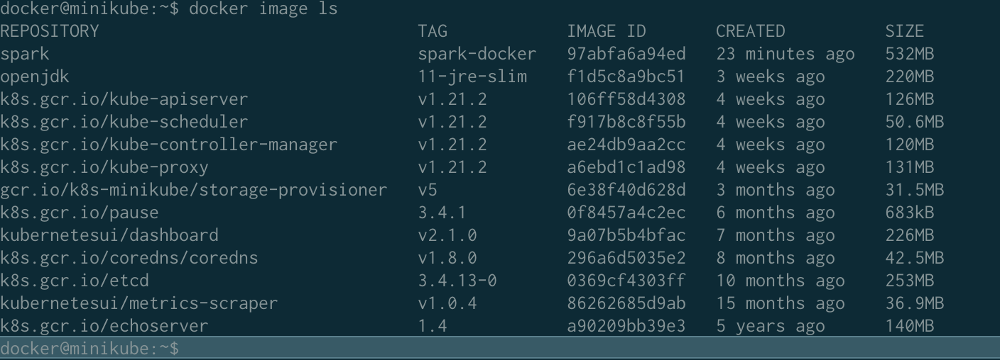

---
authors:
  - BZ
date: 
  created: 2021-07-18 05:53:45

tags:
  - Data Engineer
categories: 
  - K8s
---
# Setup Minikube
<!-- more -->
## Installation 
```bash
brew upgrade 
brew install minikube
brew install kubectl
# minikube kubectl -- get pods -A
```

## Start/Stop Cluster
```bash
#minikube start
minikube start --driver=hyperkit
minikube stop
```

## Interact with Cluster
```bash
minikube dashboard --alsologtostderr
```

## Deploy application
```bash
kubectl create deployment balanced --image=k8s.gcr.io/echoserver:1.4  
kubectl expose deployment balanced --type=LoadBalancer --port=8080
```


# Spark on K8s
[Official Reference](https://spark.apache.org/docs/latest/running-on-kubernetes.html)

## Build Spark image
- brew install spark
- build image via **docker-image-tool.sh**
```bash
sh /usr/local/Cellar/apache-spark/3.1.2/bin/docker-image-tool.sh -m -t spark-docker build
```
- check image
```bash
minikube ssh
docker image ls
```



## Submit a sample job
- Find master node of K8s
```bash
kubectl cluster-info
```
- submit job
```bash
# spark-submit --master k8s://https://192.168.64.2:8443 --deploy-mode cluster --name spark-pi --class org.apache.spark.examples.SparkPi --conf spark.executor.instances=3 --conf spark.kubernetes.container.image=gcr.io/spark-operator/spark:v2.4.5 --conf spark.kubernetes.namespace=default local:///usr/local/opt/apache-spark/libexec/examples/jars/spark-examples_2.12-2.4.5.jar

bin/spark-submit \
--master k8s://https://192.168.99.100:8443 \
--deploy-mode cluster \
--name spark-pi \
--class org.apache.spark.examples.SparkPi \
--conf spark.driver.cores=1 \
--conf spark.driver.memory=512m \
--conf spark.executor.instances=2 \
--conf spark.executor.memory=512m \
--conf spark.executor.cores=1 \
--conf spark.kubernetes.container.image=gcr.io/spark-operator/spark:v2.4.5 \
--conf spark.kubernetes.container.image.pullPolicy=IfNotPresent \
--conf spark.kubernetes.authenticate.driver.serviceAccountName=spark \
local:///opt/spark/examples/jars/spark-examples_2.11-2.4.5.jar
```