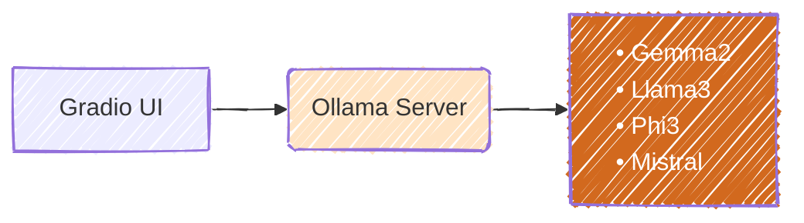

# Simple Unstructured file processing
We have a lot of pdf files that contain import information, however, the information
are unstructured (text, table, image, etc...).
To extract and utilize them in our downstream job, an open source [unstructured](https://github.com/Unstructured-IO/unstructured) is helpful to implement what we want

<!-- more -->

# Demo App

