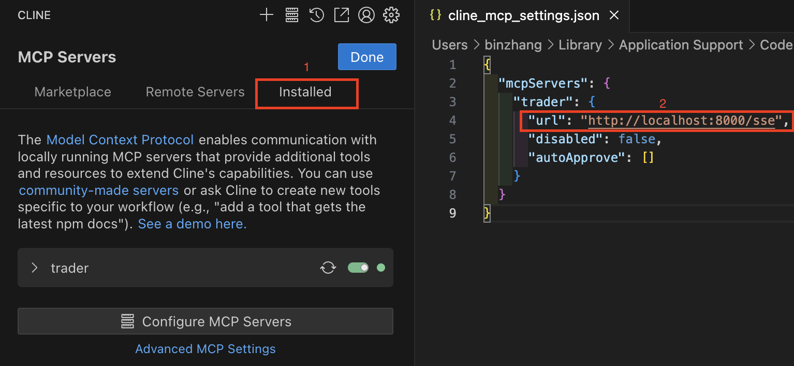
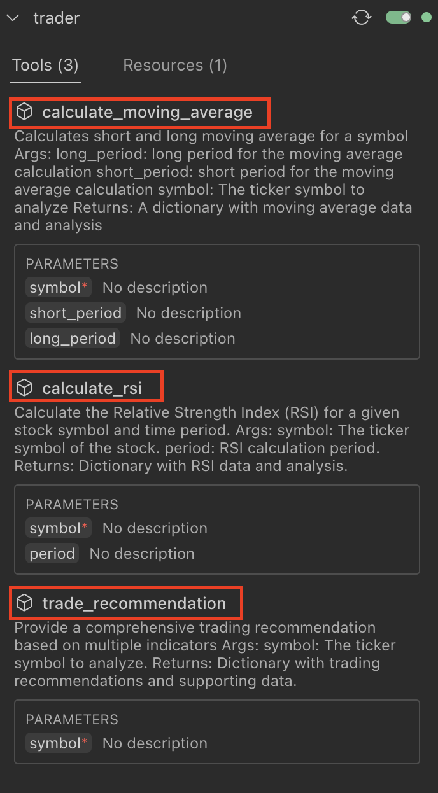
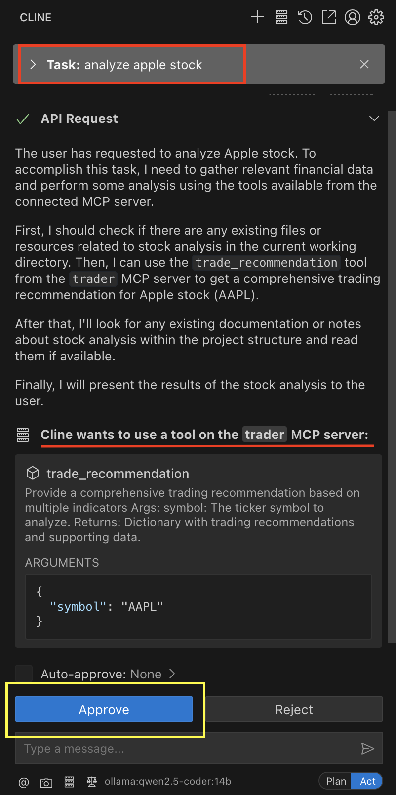
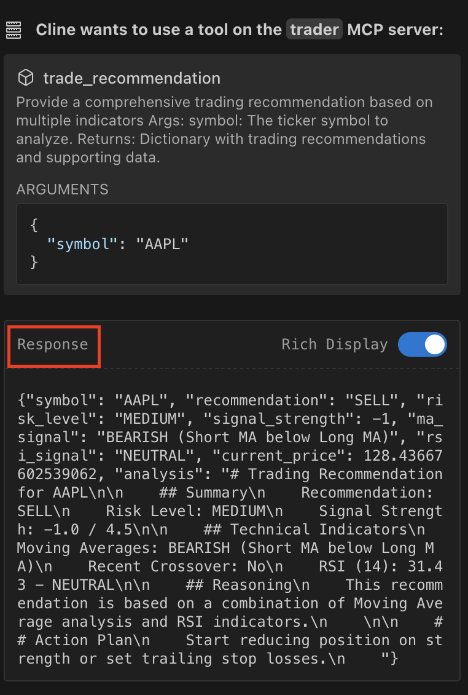

<!-- more -->

# Guide to Setting Up a MCP Server (SSE)

This guide is inspired by 

-  [Step-by-Step Guide: Building an MCP Server using Python-SDK, AlphaVantage & Claude AI](https://medium.com/@syed_hasan/step-by-step-guide-building-an-mcp-server-using-python-sdk-alphavantage-claude-ai-7a2bfb0c3096)
- [Model Context Protocol (MCP) lab](https://github.com/Azure-Samples/AI-Gateway/tree/main/labs/model-context-protocol)

> The blog is using `stdio` for communication, but we will use `Server Sent Events (SSE)`
> for **remote communication**. 

## MCP SSE Server Setup

- Start `MCP server`

- Choose MCP client host `cline` or `continue`

## `cline` configuration

- Add MCP server in `cline`

- Verify MCP tools

- submit one question and `cline` will ask for the approval of calling tool

- After approval, `cline` will call the MCP server and get the response

