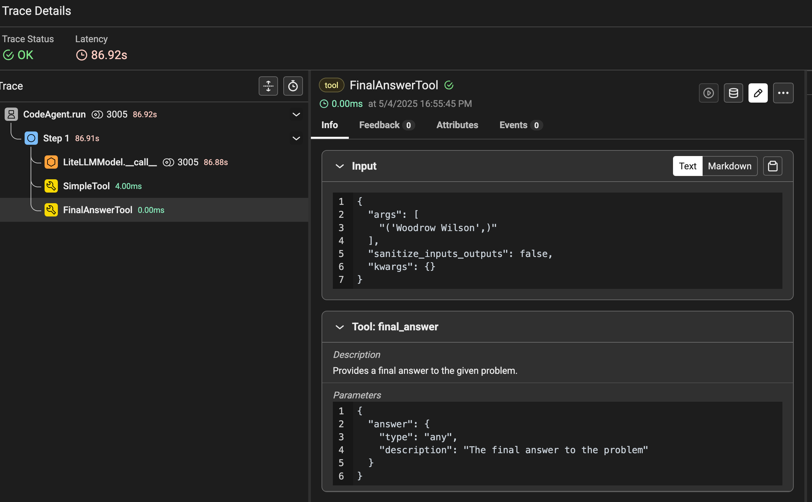

<!-- more -->

# Guide to Setting Up a Text to SQL Agent with `smolagents`
This is implemented from the guide [Code](https://huggingface.co/docs/smolagents/main/en/examples/text_to_sql)

## Output

### Question 1: `Can you give me the name of the client who got the most expensive receipt?`
```sh
━━━━━━━━━━━━━━━━━━━━━━━━━━━━━━━━━━━━ Step 1 ━━━━━━━━━━━━━━━━━━━━━━━━━━━━━━━━━━━━
 ─ Executing parsed code: ───────────────────────────────────────────────────── 
  query = "SELECT customer_name FROM receipts ORDER BY (price + tip) DESC       
  LIMIT 1;"                                                                     
  result = sql_engine(query)                                                    
  # Split the result to get the customer name from the second line              
  lines = result.split('\n')                                                    
  customer = lines[1].strip()                                                   
  final_answer(customer)                                                        
 ────────────────────────────────────────────────────────────────────────────── 
Out - Final answer: ('Woodrow Wilson',)
[Step 1: Duration 86.91 seconds| Input tokens: 2,099 | Output tokens: 906]
```

### Question 2: `Which waiter got more total money from tips?`
```sh
 ─ Executing parsed code: ───────────────────────────────────────────────────── 
  query = """                                                                   
  SELECT waiter_name, SUM(tip) AS total_tip                                     
  FROM waiters                                                                  
  JOIN receipts ON waiters.receipt_id = receipts.receipt_id                     
  GROUP BY waiter_name                                                          
  ORDER BY total_tip DESC;                                                      
  """                                                                           
  result = sql_engine(query)                                                    
  print("SQL Result:", result)                                                  
 ────────────────────────────────────────────────────────────────────────────── 
Execution logs:
SQL Result: 
('Michael Watts', 5.669999822974205)
('Corey Johnson', 1.2000000476837158)
('Margaret James', 1.0)

Out: None
[Step 1: Duration 146.87 seconds| Input tokens: 2,113 | Output tokens: 923]
━━━━━━━━━━━━━━━━━━━━━━━━━━━━━━━━━━━━ Step 2 ━━━━━━━━━━━━━━━━━━━━━━━━━━━━━━━━━━━━
 ─ Executing parsed code: ───────────────────────────────────────────────────── 
  final_answer("Michael Watts")                                                 
 ────────────────────────────────────────────────────────────────────────────── 
Out - Final answer: Michael Watts
[Step 2: Duration 21.90 seconds| Input tokens: 5,333 | Output tokens: 1,145]
```

## Tracing


> [!NOTE]
>
> We will add this lightweight agent into our existing LLM job to interact with SQL databases and other tools. This will allow us to trace the execution of SQL queries and other operations, providing insights into the performance and behavior of our models.