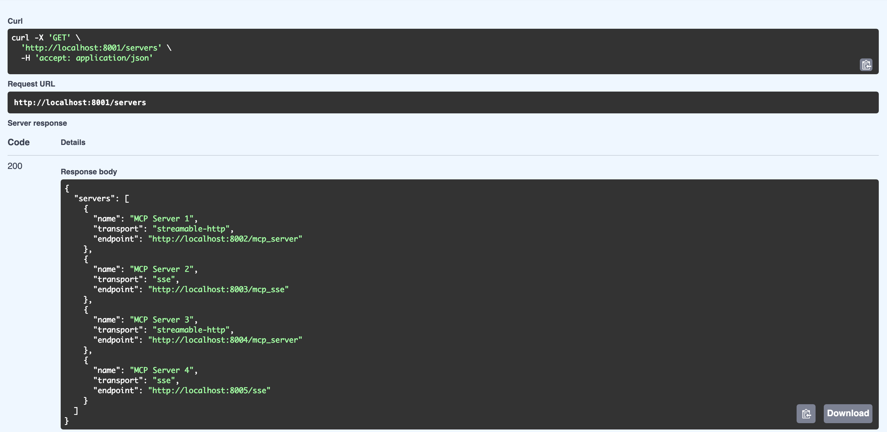

<!-- more -->
# MCP Server Hub
Currently, our different projects are using various MCP servers. 
To streamline and unify the process, we plan to implement a HUB MCP server that can handle multiple MCP Servers and reuse components.

- User Interface: User can view MCP servers from `MCP HUB`
- MCP Hub: Service that manages multiple MCP servers metadata
- MCP Servers: Different `MCP server` and their metadata automatically register to `MCP HUB`

``` mermaid
graph TD
  E[User Interface] --> A[MCP Hub]
  A --> B[MCP Server 1];
  A --> C[MCP Server 2];
  A --> D[MCP Server 3];
  A --> e[MCP Server 4];
```

# Implementation

- [x] Prerequisites:
    - `fastmcp`
    - `fastapi`
    - `npx @modelcontextprotocol/inspector` : tool to debug MCP servers.

- [x] MCP Hub: FastAPI
    - `register` endpoint: Each MCP server will call it to register metadata into this MCP Hub
    - `servers` endpoint: list all MCP Servers' detail

```python linenums="1"
app = FastAPI(title="MCP HUB", lifespan=lifespan)
_TAG="MCP-HUB"

def get_mcp_hub(request:Request) -> MCPHub:
    return request.app.state.mcp_hub


@app.post("/register", tags=[_TAG])
def register(server_info: Annotated[MCPServerInfo, Form()], mcp_hub=Depends(get_mcp_hub)):
    mcp_hub.servers.append(server_info)
    return JSONResponse(content=mcp_hub.model_dump())

@app.get("/servers", tags=[_TAG])
def get(mcp_hub=Depends(get_mcp_hub)):
    return JSONResponse(content=mcp_hub.model_dump())


if __name__ == '__main__':
    import uvicorn
    uvicorn.run(app, host="localhost", port=8001)
```

- [x] MCP Server: FastMCP and FastAPI
    - Create MCP server : `tool`, `resources`, `prompts` etc.
    - FastAPI server: Mount MCP server to FastAPI APP

```python linenums="1"
#######################
# MCP Server Setup    #
#######################

# Create MCP server
mcp_server = FastMCP("MCP Server 1")

@mcp_server.tool()
async def greet1():
    return "Hello from MCP Server 1 !"

# Create the MCP HTTP app

mcp_http_app = mcp_server.http_app(_MCP_SERVER_PATH, transport="streamable-http")


#######################
# FastAPI Setup       #
#######################


@asynccontextmanager
async def lifespan(app: FastAPI):
    # Your startup logic here
    logger.info("Starting up...")
    # Start MCP lifespan
    async with mcp_http_app.lifespan(app):
        # Mount after MCP is initialized
        app.mount(_MCP_MOUNT_PATH, mcp_http_app)

        # Register FastMCP Server into MCP hub
        mcp_server_info = MCPServerInfo(
            name="MCP Server 1",
            transport="streamable-http",
            endpoint=f"http://localhost:{_MCP_SERVER_PORT}{_MCP_SERVER_PATH}"
        )
        async with httpx.AsyncClient() as client:
            try:
                resp = await client.post(f"{MCP_HUB_URL}/register", data=mcp_server_info.model_dump())
                resp.raise_for_status()
                logger.info(f"Registered to MCP Hub\n{resp.json()}")
            except Exception as e:
                logger.error(f"[ERROR] MCP registration failed: {e}")
        yield

        # Your shutdown logic here
        logger.info("Shutting down...")

app = FastAPI(lifespan=lifespan)

if __name__ == "__main__":
    uvicorn.run(app, port=8002)

```

# MCP Hub & Server
Once MCP server start at the background, it will register itself to the MCP hub. 
The MCP hub is responsible for inquiring about available servers and managing the metadata of these servers.

- [x] MCP Hub Swagger UI


- [x] MCP Server in `Inspector`


# Next...
Once MCP Hub is running, we can create a client to interact with the MCP hub and choose a server from the available servers. 
You can use below frameworks to connect MCP server

- `langchain`
- `google adk`
- `fastmcp client`
- ...