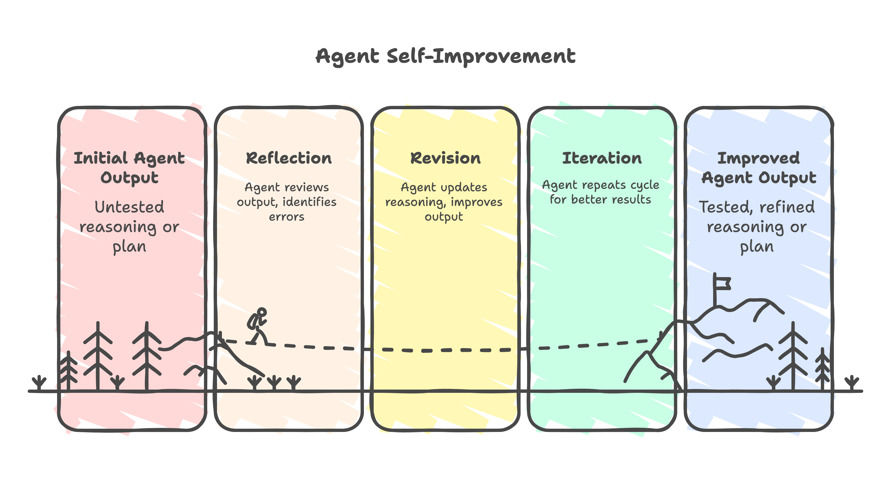

<!-- more -->

# Langgraph Reflections

## Overview



Reflection is related to agent self-improvement or reasoning feedback loops.

- Reflection is a framework-level pattern (or module) that enables an LLM agent to evaluate its own outputs, learn from mistakes, and revise or improve results across iterations.
- Reflexion: It’s an agent training framework where an LLM learns from verbal feedback (its own or from a reward model) through multiple episodes — akin to reinforcement learning (RL) but using text-based reflection.
- Language Agent Tree Search (LATS): It is a framework that combines LLMs with tree-search planning, inspired by algorithms like Monte Carlo Tree Search (MCTS).

## **Reflection**

The agent goes through a `Reflect → Revise cycle`:

1.	Generation: The agent produces an initial answer or plan.
2.	Reflection: The agent reviews that output — often using another LLM call — and identifies mistakes or improvements.
3.	Revision: The agent updates its reasoning or final output based on the reflection.


## **RefleXion** [paper](https://arxiv.org/pdf/2303.11366)

The agent goes through each episode involving:

1.	Trajectory Generation → The agent takes actions and generates an outcome.
2.	Reflection → The agent verbalizes what worked or failed.
3.	Improvement → The agent uses the reflection to guide the next episode’s reasoning or action sequence.

This process yields cumulative learning across episodes — a meta-learning approach for long-term reasoning and self-correction.


## **LATS** [paper](https://arxiv.org/pdf/2310.04406)

 `LATS` lets an LLM **simulate multiple reasoning paths**, evaluate them, and select the best one — instead of following a single linear reasoning trace (like in ReAct or standard chain-of-thought).

 ```sh
           Root (Question)
           /      |      \
   Step A1     Step B1     Step C1
     |           |           |
   ...         ...         ...
   (each branch grows via reasoning steps)
 ```

 ### Algorithmic Structure

A simplified LATS loop looks like:

1.	Expansion

    > Generate multiple next-step reasoning candidates from the current node using an LLM.
    
2.	Evaluation

    > Use another LLM call (or a value function) to score each candidate by quality, correctness, or expected utility.

3.	Selection / Backpropagation

    > Propagate scores up the tree and select the best reasoning trajectory.

4.	Termination

    > Stop when a branch reaches a high-confidence or goal state (e.g., complete answer or solved task).