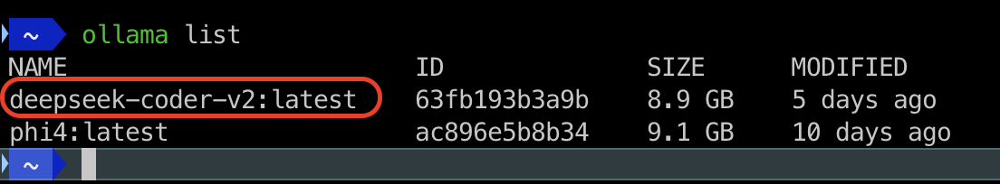
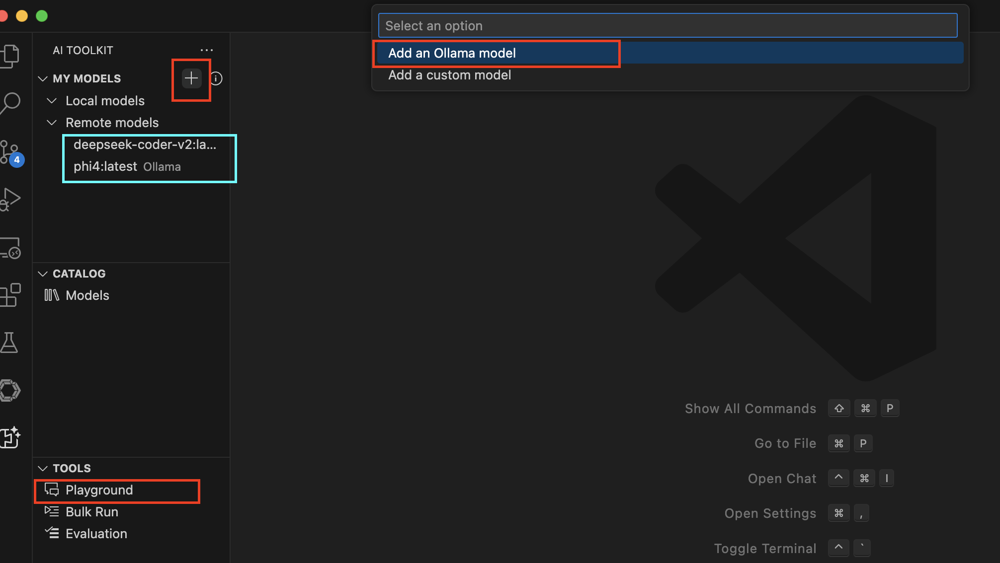
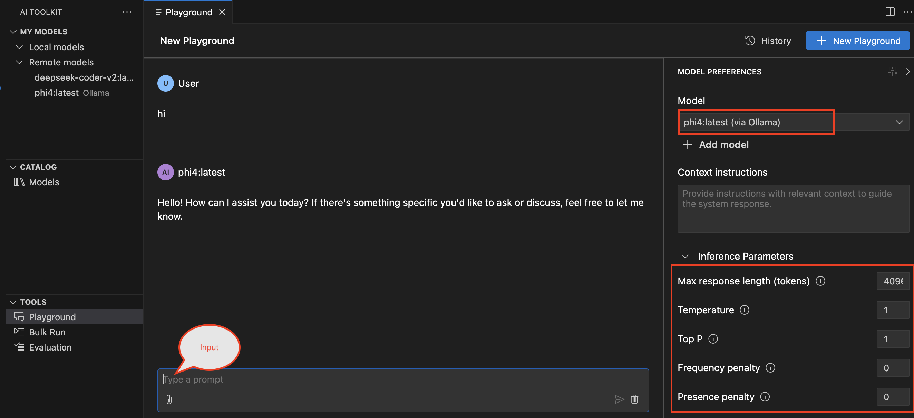
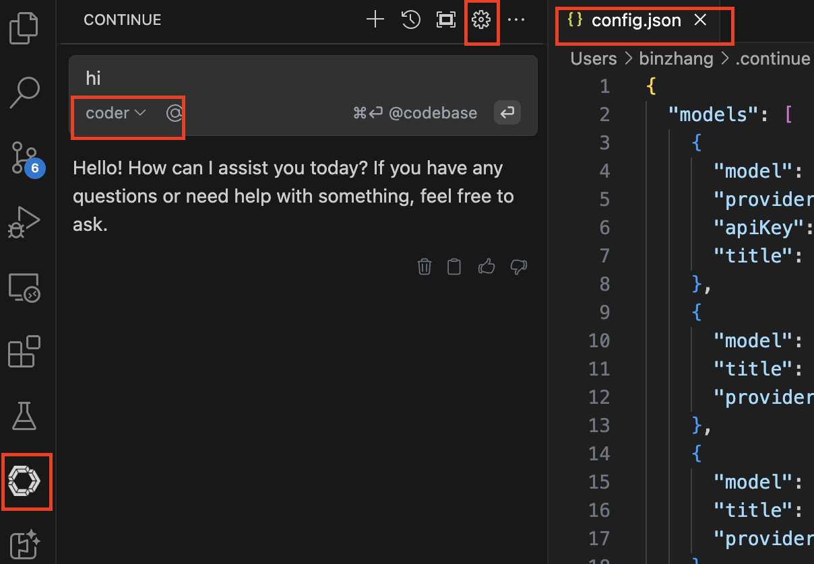
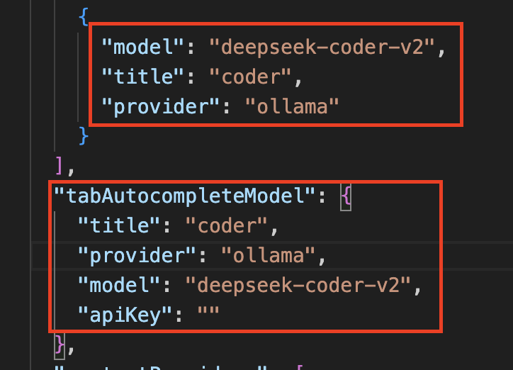
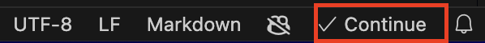

# Local LLM Setup
<!-- more -->

# Introduction
This guide will walk you through setting up a local language model (LLM) using Ollama. Ollama is an open-source, lightweight language model that can be run locally on your machine or server. This setup allows for greater privacy and control over the model, as well as potentially faster inference times compared to cloud-based services.
## Prerequisites
Before you begin, ensure you have the following:
- Python installed (version 3.11 or later)
- Ollama installed
- Basic knowledge of Python programming
## Installation
### Step 1: Python Virtual Environment 
```bash
python -m venv ollama_env
source ollama_env/bin/activate  # On Windows, use `ollama_env\Scripts\activate`
```
### Step 2: Install Ollama
```bash
brew install ollama
# After installation, you can verify it by running:
brew services start ollama # For macOS users or Linux users using systemd.
# If you prefer to run it as a non-service:
ollama serve &
# -----------------------------------------------
ollama --version
ollama list
```
### Step 3: Install Ollama Models
- Command line : `ollama pull <model_name>`
- Manually import: [Guide](https://github.com/ollama/ollama/blob/main/docs/import.md)

### Step 4: Verify LLM Models


# Utilization of Ollama
## Copilot
Without `GitHub Copilot`, you can use Ollama for code generation and assistance in your projects. Here’s how to set it up:

### VSCode Setup
- **AI Toolkit for Visual Studio Code** Extension

  - Additionally, you can configure your OpenAI API key if needed
  - Chatbot in Playground: Use Ollama as a chatbot to assist with coding tasks directly within VSCode.

- **Continue** Extension
  - This extension allows you to continue from where the code snippet left off, making it easier to build on existing code without starting from scratch.
  - Open `config.json` 
  - Add Ollama config
  

- If you find this in your VSCode, congratulations! You have successfully set up Ollama for code generation and assistance in Visual Studio Code.


### Pycharm & IDEA Setup
- **Continue** Extension installed from the JetBrains Marketplace
- Follow the same steps as VSCode setup to configure Ollama in your preferred IDE.

## RAG with Ollama: A Comprehensive Guide

RAG (Retrieval Augmented Generation) is a powerful technique that enhances the capabilities of large language models by integrating external data sources, such as documents or databases, into the generation process. This integration allows for more accurate and relevant responses to queries, making it an essential tool in various applications, including but not limited to:

- **Technical Documentation Assistance**
- **Code Generation & Debugging**
- **Research Paper Summarization**
- **Customer Support Chatbots**

### Setting Up RAG with Ollama

To set up RAG with Ollama, you'll need to follow these steps:

1. **Install Ollama**: Ensure that Ollama is properly installed and configured in your preferred IDE or text editor.
2. **Configure Data Sources**: Ollama supports various data sources such as local files, databases, and APIs. You can configure these data sources through the Ollama interface or configuration file.   
